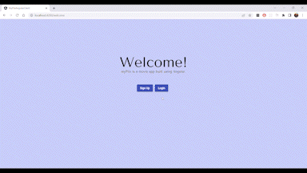

# MyFlixAngularClient

This project was built with [Angular CLI](https://github.com/angular/angular-cli) version 14.2.6. It is the client-side for an application called myFlix based on its existing server-side code (REST API and database).



## Key Features
- Your app should display a welcome view where users will be able to either log in or register an
-ccount.
- Once authenticated, the user should now view all movies.
- Upon clicking on a particular movie, users will be taken to a single movie view, where additional movie details will be displayed. The single movie view will contain the following additional features:
1. A button that when clicked takes a user to the director view, where details about the director of that particular movie will be displayed.
2. A button that when clicked takes a user to the genre view, where details about that particular genre of the movie will be displayed.

## Dependencies
```
"dependencies": {
    "@angular/animations": "^14.2.0",
    "@angular/cdk": "^14.2.5",
    "@angular/common": "^14.2.0",
    "@angular/compiler": "^14.2.0",
    "@angular/core": "^14.2.0",
    "@angular/forms": "^14.2.0",
    "@angular/material": "^14.2.5",
    "@angular/platform-browser": "^14.2.0",
    "@angular/platform-browser-dynamic": "^14.2.0",
    "@angular/router": "^14.2.0",
    "rxjs": "~7.5.0",
    "tslib": "^2.3.0",
    "zone.js": "~0.11.4"
},
"devDependencies": {
    "@angular-devkit/build-angular": "^14.2.6",
    "@angular/cli": "~14.2.6",
    "@angular/compiler-cli": "^14.2.0",
    "@types/jasmine": "~4.0.0",
    "jasmine-core": "~4.3.0",
    "karma": "~6.4.0",
    "karma-chrome-launcher": "~3.1.0",
    "karma-coverage": "~2.2.0",
    "karma-jasmine": "~5.1.0",
    "karma-jasmine-html-reporter": "~2.0.0",
    "typedoc": "^0.23.19",
    "typescript": "~4.7.2"
}
```

## Project Link

https://gracesuhyun.github.io/myFlix-Angular-client/welcome

## Additional Information

### Development server

Run `ng serve` for a dev server. Navigate to `http://localhost:4200/`. The application will automatically reload if you change any of the source files.


### Code scaffolding

Run `ng generate component component-name` to generate a new component. You can also use `ng generate directive|pipe|service|class|guard|interface|enum|module`.


### Build

Run `ng build` to build the project. The build artifacts will be stored in the `dist/` directory.


### Running unit tests

Run `ng test` to execute the unit tests via [Karma](https://karma-runner.github.io).


### Running end-to-end tests

Run `ng e2e` to execute the end-to-end tests via a platform of your choice. To use this command, you need to first add a package that implements end-to-end testing capabilities.


### Further help

To get more help on the Angular CLI use `ng help` or go check out the [Angular CLI Overview and Command Reference](https://angular.io/cli) page.
